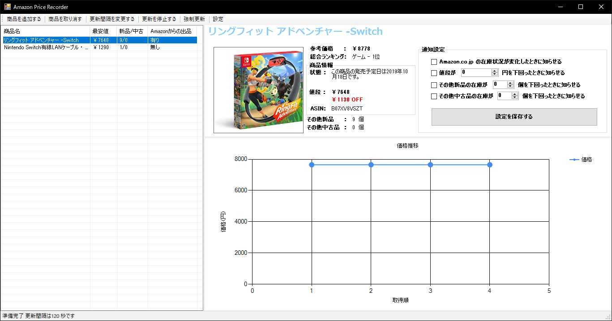

<h1 align="center">Amazon Price Recorder</h1>

    

## Introduction
Amazonにある商品の価格変動を記録・通知します。

Checks and recording prices changes of Amazon products, and notify you when prices are going down, or when stocks are running short.

## Features
* 商品の価格・在庫・ランキング・ASINを取得
 
Get product information such as prices, stocks, ranking, etc.
* 価格変動のグラフ表示
 
Chat of price changes
* 商品入荷時・指定価格を下回った時・指定在庫数を下回った時 に通知
 
Notify when there's restocking, prices/stocks goes down.

## License
[MIT License](https://en.wikipedia.org/wiki/MIT_License)